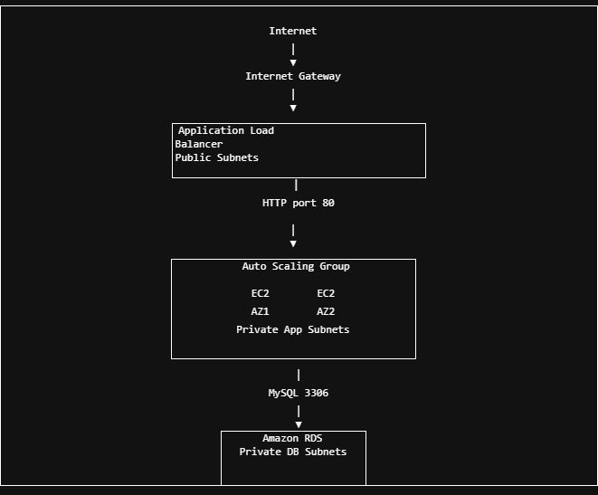
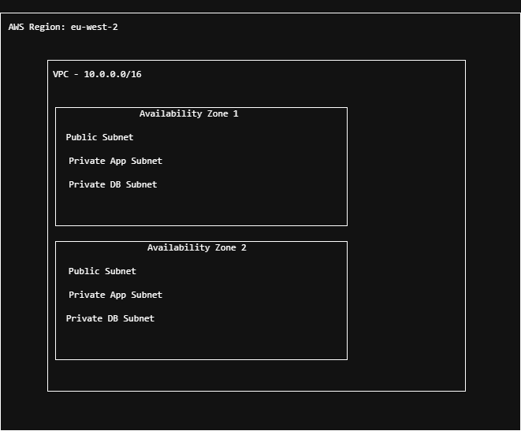

# AWS Multi-Tier Application with Terraform

## About the Project

I built this project to improve my Terraform skills and get more experience building AWS infrastructure as code.

The project is a multi-tier AWS environment with a load balancer, EC2 application servers and an RDS MySQL database.

Instead of creating the resources manually in the AWS Console, I used Terraform to build and manage the infrastructure.

## Architecture

The application uses a multi-tier AWS architecture with the load balancer in the public layer, EC2 application servers in private subnets, and the database in private database subnets.



### Network Layout

The VPC is spread across two Availability Zones, with public, private application, and private database subnets.



The infrastructure is spread across two Availability Zones in the London region (`eu-west-2`).

I created:

- 1 VPC
- 2 public subnets
- 2 private application subnets
- 2 private database subnets
- Internet Gateway
- NAT Gateway
- Application Load Balancer
- Auto Scaling Group
- EC2 Launch Template
- RDS MySQL database
- Security Groups
- IAM role and instance profile

## Networking

I separated the network into public, application and database layers.

The Application Load Balancer sits in the public subnets because users need to be able to reach it from the internet.

The EC2 application servers are in private subnets. They are not directly accessible from the internet.

I used a NAT Gateway so the EC2 instances can still make outbound internet connections when needed.

The RDS database is in separate private database subnets and does not have a route to the internet.

## Security

I wanted each part of the architecture to only communicate with what it actually needs.

The traffic flow is:

```text
Internet → ALB → EC2 → RDS
```

The ALB accepts HTTP traffic on port 80.

The EC2 application servers accept port 80 traffic from the ALB security group rather than directly from the internet.

The MySQL database accepts port 3306 traffic only from the application security group.

The database is also configured as:

```text
publicly_accessible = false
```

This means the database cannot be accessed directly from the public internet.

I also used an IAM role with AWS Systems Manager permissions for the EC2 instances instead of opening SSH access to the internet.

## Load Balancing and Auto Scaling

The Application Load Balancer sends requests to the EC2 application servers.

The EC2 instances are managed by an Auto Scaling Group and run across two private application subnets.

I used a Launch Template to define how the EC2 instances should be created.

During testing, both EC2 instances showed as healthy in the ALB target group.

I was also able to access the application through the ALB DNS address.

The test page displayed:

```text
AWS Multi-Tier Application

Application server deployed with Terraform.
```

## Database

I used Amazon RDS with MySQL for the database layer.

The database:

- Runs in private DB subnets
- Is not publicly accessible
- Uses encrypted storage
- Only accepts MySQL traffic from the application servers

For this project I used a small RDS instance and did not enable Multi-AZ to keep the cost lower.

In a production environment I would consider enabling Multi-AZ for better availability.

## Terraform

The infrastructure was built using Terraform.

My normal workflow was:

```bash
terraform init
terraform fmt
terraform validate
terraform plan
terraform apply
```

After finishing the infrastructure I ran another:

```bash
terraform plan
```

Terraform returned:

```text
No changes. Your infrastructure matches the configuration.
```

This confirmed that my Terraform configuration matched what was running in AWS.

## Problems I Ran Into

One problem I ran into was IAM permissions.

Terraform initially couldn't create the IAM role because the AWS account I was using didn't have the required `iam:CreateRole` permission.

I checked the error and found that the problem was with the permissions of my AWS Identity Center account rather than the Terraform code.

I also had an issue where my AWS SSO login expired and Terraform could no longer authenticate with AWS. I logged back into AWS SSO and verified my identity before running Terraform again.

These problems helped me understand the difference between authentication and permissions in AWS.

## Scaling

If the application received a lot more traffic, the Auto Scaling Group could run more EC2 instances and the load balancer could distribute traffic between them.

For a bigger production environment I could also add Auto Scaling policies based on things like CPU usage or request count.

If the database became a bottleneck, I could increase the RDS instance size or look at options such as read replicas depending on the workload.

## Cost

Some of the main resources in this project that cost money are:

- NAT Gateway
- Application Load Balancer
- EC2
- RDS

For a real environment I would monitor usage and right-size the resources rather than leaving more capacity running than needed.

Because this is a portfolio project, I can also destroy the infrastructure when I am not using it to avoid unnecessary charges.

## What I Learned

This project gave me more practical experience with:

- Terraform
- VPC networking
- Public and private subnets
- Route tables
- Internet and NAT Gateways
- Security Groups
- IAM
- Application Load Balancers
- Auto Scaling
- EC2
- RDS
- Troubleshooting AWS permissions
- AWS SSO authentication

The biggest thing I learned was how all of these AWS services work together rather than looking at each service separately.

## Future Improvements

There are several things I could add later:

- HTTPS and an SSL certificate
- Route 53 and a custom domain
- Auto Scaling policies
- CloudWatch monitoring and alarms
- AWS Secrets Manager for the database password
- Multi-AZ RDS
- Remote Terraform state
- Terraform modules
- GitHub Actions CI/CD

## Cleanup

The infrastructure can be removed using:

```bash
terraform destroy
```

This is useful for avoiding charges when the project is not being used.
